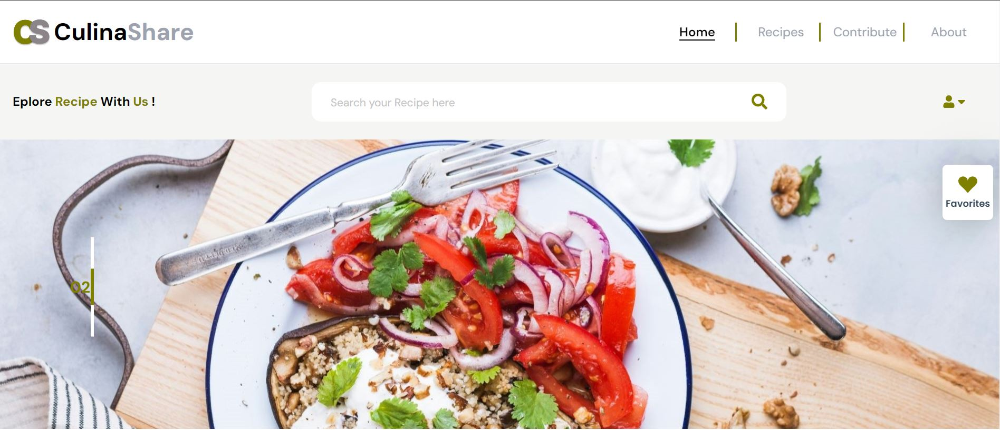

## CulinaShare Web App

CulinaShare is Website where users can explore a wide variety of recipes, contribute their own, and curate their collection of favorites. The platform seeks to inspire culinary creativity and make cooking accessible to everyone, from beginners to gourmet chefs.




### Functionalities/Features of A User :

- Authentication & Authorisation (Creating Account / Logging in)
- Searching Recipe
- Exploring Recipes and Their Detailed info
- Sorting Recipe by Category
- Adding & Viewing Favorites Recipe
- Contribute (Add A Recipe and Their Details)
- A user can not View his/her Favorites and Contribute Without Being Logged in


### CulinaShare is Built with


## Prerequisites

  - Node.js 

## To Get Started 

- Clone the Project Repo by using `git` : 

``` bash 
  git clone https://github.com/Niyonyungu/CulinaShare.git
```

- Install dependencies using `npm`: 
  ```bash
  npm install
  ```
- Run the app using `npm`
  ```bash
  npm run start
  ```

## Live/Deployed Version

 ```bash
 https://culina-share-five.vercel.app/
  ```


